# 🇨🇦 Canadian Monthly Retail Trade Sales — End-to-End Analytics Project

> **A complete data analytics pipeline** covering data ingestion, cleaning, exploratory analysis, Power BI dashboarding, and time-series forecasting on Statistics Canada's Monthly Retail Trade Survey (2017–2026).

---

## 📋 Table of Contents

1. [Project Overview](#-project-overview)
2. [Business Problem & Goals](#-business-problem--goals)
3. [Dataset](#-dataset)
4. [Project Structure](#-project-structure)
5. [Technology Stack](#-technology-stack)
6. [Data Cleaning & Feature Engineering](#-data-cleaning--feature-engineering)
7. [Exploratory Data Analysis — Charts & Insights](#-exploratory-data-analysis--charts--insights)
8. [Power BI Dashboards](#-power-bi-dashboards)
9. [Key KPI Results](#-key-kpi-results)
10. [Forecasting](#-forecasting)
11. [Recommendations & Suggestions](#-recommendations--suggestions)
12. [How to Run](#-how-to-run)
13. [Author](#-author)

---

## 🔍 Project Overview

Canadian retail businesses and policymakers require granular, reliable data to understand consumer spending patterns across provinces and industries. This project performs a **full-stack retail analytics study** using Statistics Canada's official monthly retail trade data, answering critical questions such as:

- Which industries generate the most revenue — and which are growing fastest?
- How does seasonality affect purchasing behavior across sectors?
- What share of retail is now happening online?
- Which provinces drive — or lag — national retail performance?
- What will Canadian retail sales look like over the next 12 months?

The project delivers a fully documented Python analysis pipeline and an interactive 4-page Power BI dashboard system, suitable for executive presentations or further academic study.

---

## 🎯 Business Problem & Goals

### Problem Statement

Retail businesses and policymakers need a single, authoritative view of Canadian retail performance that answers questions about industry trends, regional disparities, seasonal fluctuations, e-commerce adoption, and future demand.

### Primary Goals

| # | Goal | Description |
|---|------|-------------|
| 1 | **Monitor Industry Performance** | Identify top-performing, declining, and volatile retail sectors |
| 2 | **Analyze Geographic Performance** | Determine which provinces contribute most and grow fastest |
| 3 | **Understand Seasonality** | Quantify holiday spikes and seasonal adjustment differences |
| 4 | **Measure E-Commerce Growth** | Track digital retail's rising share of total sales |
| 5 | **Improve Forecasting & Planning** | Predict the next 12 months of retail demand with confidence intervals |

---

## 📦 Dataset

| Attribute | Detail |
|-----------|--------|
| **Source** | Statistics Canada — [Table 20-10-0056-01](https://www150.statcan.gc.ca/t1/tbl1/en/tv.action?pid=2010005601) |
| **Publisher** | Government of Canada (Statistics Canada) |
| **Frequency** | Monthly — January 2017 to February 2026 |
| **Coverage** | Canada, all provinces/territories, and key Census Metropolitan Areas |
| **Classification** | North American Industry Classification System (NAICS) |
| **Value Unit** | Dollars × 1,000 (thousands) |
| **Raw Rows** | 76,482 records |
| **Columns** | 17 original → 12 retained after cleaning |
| **Adjustment Types** | Unadjusted + Seasonally Adjusted |

### Key Columns (After Cleaning)

| Column | Description |
|--------|-------------|
| `REF_DATE` | Reference date (monthly) |
| `GEO` | Geographic region (province, territory, CMA) |
| `Industry` | NAICS retail sub-sector (code stripped) |
| `Sales` | Sale type label |
| `Adjustments` | Unadjusted or Seasonally Adjusted |
| `Sales_Actual` | VALUE × 1,000 — true dollar amounts |
| `Year` | Extracted calendar year |
| `Month` | Extracted month number (1–12) |
| `Month_Name` | Full month name |
| `Quarter` | Fiscal quarter (1–4) |
| `Geo_Level` | National / Province / Territory / City |

---

## 📁 Project Structure

```
📦 Canadian-Retail-Sales-Analysis/
├── 📓 Data_cleaning.ipynb               # Step 1: Raw data cleaning & feature engineering
├── 📓 Data_Analysis.ipynb               # Step 2: Full EDA, KPIs, forecasting
├── 📊 PowerBI_Dashboard.pbix            # Interactive Power BI report (4 pages)
├── 📂 Dataset/
│   └── 20100056.csv                     # Raw Statistics Canada data
├── 📂 visualizations_images/            # All 15 exported analysis charts
│   ├── 01_monthly_sales_trend.png
│   ├── 02_mom_yoy_growth.png
│   ├── 03_top_industry_total_sales.png
│   ├── 04_industry_market_share.png
│   ├── 05_industry_growth_rate.png
│   ├── 06_seasonal_industry_heatmap.png
│   ├── 07_province_sales_contribution.png
│   ├── 08_provincial_growth_rate.png
│   ├── 09_provincial_sales_trend.png
│   ├── 10_ecommerce_sales_share.png
│   ├── 11_adjusted_vs_unadjusted.png
│   ├── 12_monthly_sales_heatmap.png
│   ├── 13_holiday_sales_spike.png
│   ├── 14_seasonal_stability_score.png
│   └── 15_forecast_visualization.png
├── 📂 PowerBI_Screenshots/
│   ├── 1_Executive_Overview.PNG
│   ├── 2_Industry_Performance.PNG
│   ├── 3_Geographic_Analysis.PNG
│   └── 4_Forecasting.PNG
├── 📄 Business_goals_and_KPIs.docx
├── 📄 Canadian_Monthly_Retail_Trade_Sales_Dataset_Description.docx
├── 📄 Power_BI_Dashboard_Architecture.docx
└── 📄 README.md
```

---

## 🛠 Technology Stack

| Layer | Tool / Library | Purpose |
|-------|---------------|---------|
| **Language** | Python 3.x | Core analysis language |
| **Data Manipulation** | pandas, numpy | Data wrangling, feature engineering |
| **Visualization** | matplotlib, seaborn | Static chart generation |
| **Forecasting** | statsmodels (Holt-Winters) | Triple Exponential Smoothing model |
| **BI Dashboarding** | Microsoft Power BI Desktop | Interactive dashboard system |
| **Data Source** | Statistics Canada Open Data | Official government retail data |
| **Notebook Environment** | Jupyter Notebook | Reproducible analysis pipeline |
| **Version Control** | Git / GitHub | Code versioning and collaboration |

---

## 🧹 Data Cleaning & Feature Engineering

**Notebook:** `Data_cleaning.ipynb`

### Steps Performed

1. **Loaded** raw CSV (76,482 rows × 17 columns)
2. **Inspected** data types, null counts, and duplicate rows — zero duplicates found
3. **Converted** `REF_DATE` from string to datetime for temporal operations
4. **Extracted** temporal features: `Year`, `Month`, `Month_Name`, `Quarter`
5. **Stripped** NAICS codes from industry names (e.g., `Retail trade [44-45]` → `Retail trade`)
6. **Created** `Geo_Level` column: `National` / `Province` / `Territory` / `City`
7. **Scaled** the `VALUE` column by 1,000 → `Sales_Actual` (true dollar amounts)
8. **Dropped** 9 administrative metadata columns: `DGUID`, `UOM_ID`, `SCALAR_ID`, `VECTOR`, `COORDINATE`, `STATUS`, `SYMBOL`, `TERMINATED`, `DECIMALS`
9. **Verified** whitespace-free text columns (zero padding issues found)
10. **Exported** cleaned dataset for analysis notebook

### Missing Values Handled

| Column | Missing | Resolution |
|--------|---------|-----------|
| `VALUE` | 9,988 | Retained as NaN — represent suppressed/unreported figures by Statistics Canada |
| `STATUS` | 39,321 | Dropped (metadata column) |
| `SYMBOL`, `TERMINATED` | 76,482 (all) | Dropped (empty columns) |

---

## 📊 Exploratory Data Analysis — Charts & Insights

**Notebook:** `Data_Analysis.ipynb` | **15 visualizations produced**

---

### 1 · Monthly Sales Trend (2017–2026)

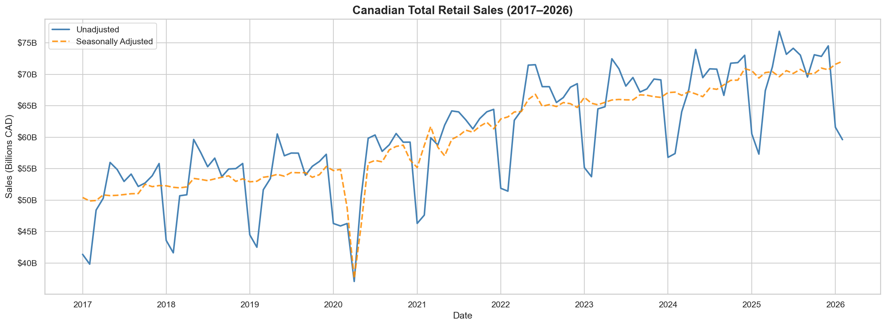

**Insight:** Canadian retail sales grew steadily from ~$51B/month in early 2017 to a peak of **$76.8B in May 2025** (+50.6% total growth). A sharp COVID-19 dip bottomed out at **$37.1B in April 2020**, followed by a strong V-shaped recovery driven by pent-up consumer demand and government stimulus.

---

### 2 · Month-over-Month & Year-over-Year Growth

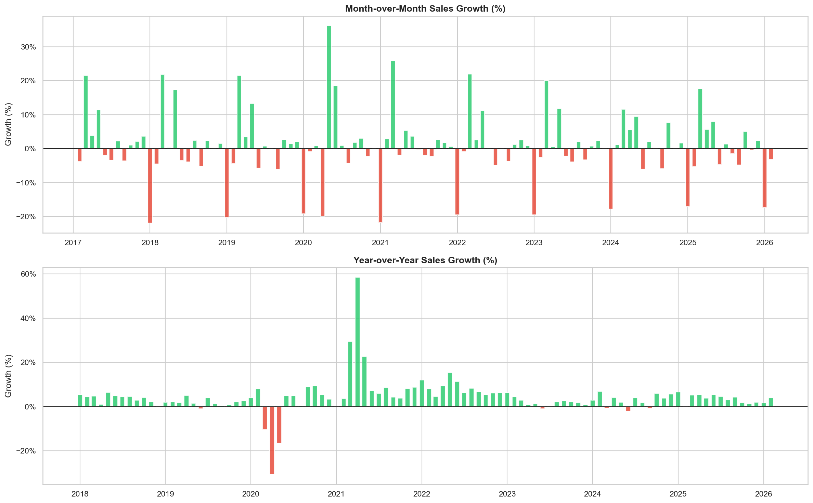

**Insight:** Average MoM growth is **+0.82%**, while average YoY growth is **+4.39%**. The most dramatic negative MoM swing was April 2020 (−28%), and the highest recovery spike was May 2020 (+18.7%). YoY growth stabilized at 3–5% post-2022, signaling a return to pre-pandemic baseline growth.

---

### 3 · Top Industries by Total Sales

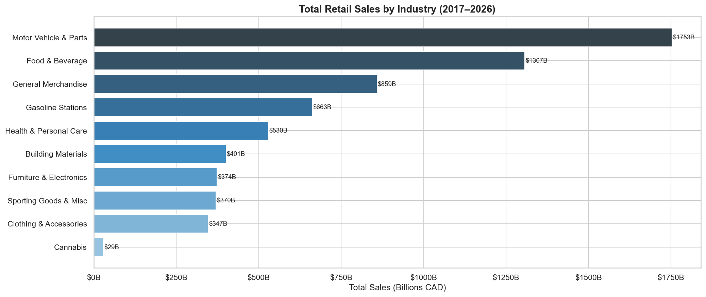

**Insight:** **Motor Vehicle & Parts Dealers** dominate with the highest cumulative revenue, followed by Food & Beverage Retailers and General Merchandise. These three sectors alone account for over 55% of all Canadian retail revenue across the study period.

---

### 4 · Industry Market Share

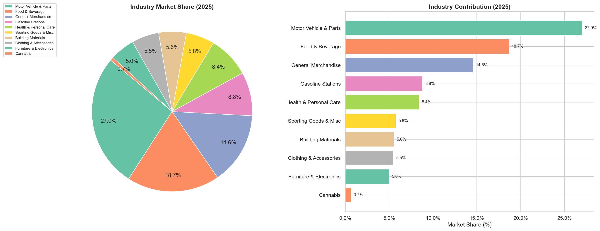

**Insight:** Motor Vehicle & Parts commands **27.0% of national retail market share** (2025 figures). The top 4 industries — Motor Vehicles, Food & Beverage, General Merchandise, and Gasoline Stations — collectively capture ~70% of the market, leaving all other sub-sectors competing for the remaining 30%.

---

### 5 · Industry Growth Rate

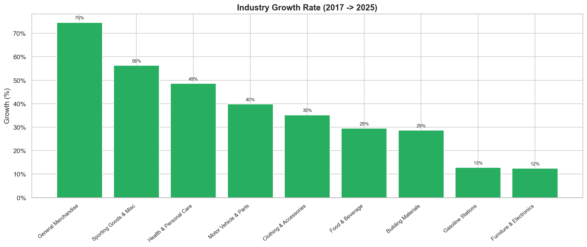

**Insight:** **General Merchandise** is the fastest-growing industry at **+74.6%** over the study period — largely driven by large-format discount retail and warehouse clubs. **Cannabis Retailers** show explosive but volatile growth since legalization. Traditional sectors like Clothing and Gasoline show more modest gains.

---

### 6 · Seasonal Industry Heatmap

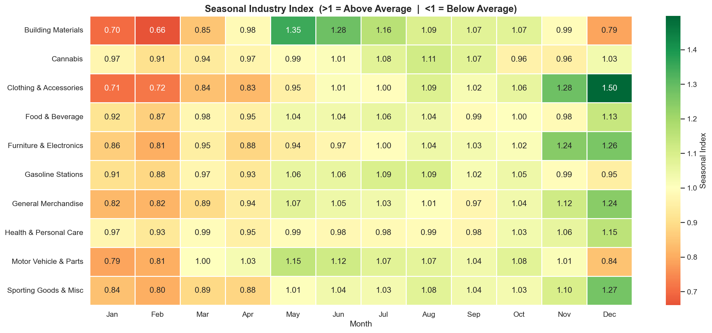

**Insight:** The heatmap reveals clear seasonal concentration in **Sporting Goods & Hobby** (peaks June–August) and **Clothing** (peaks November–December). **Food & Beverage** remains remarkably stable year-round with a coefficient of variation below 12%, making it the most reliable sector for revenue planning.

---

### 7 · Province Sales Contribution

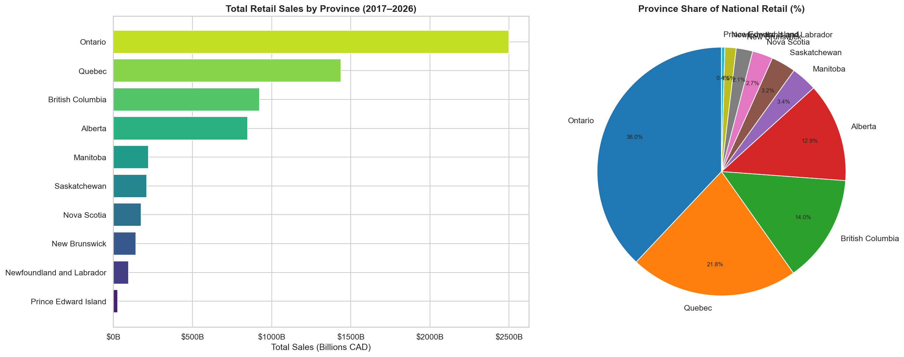

**Insight:** **Ontario alone contributes 38.0%** of all national retail sales. Quebec follows at ~22%, British Columbia at ~13%, and Alberta at ~11%. The remaining provinces and territories account for just 16% combined — highlighting a significant geographic concentration of retail activity in the east.

---

### 8 · Provincial Growth Rate

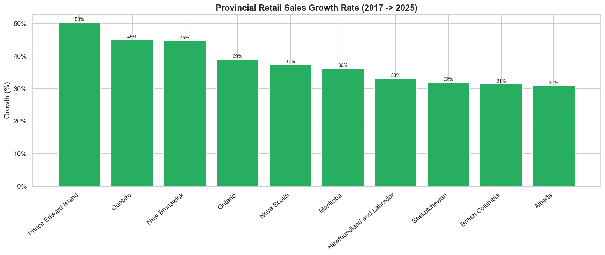

**Insight:** **Prince Edward Island** is the fastest-growing province at **+50.3%** growth — from a low base, but consistent and accelerating. Alberta shows the slowest growth (+30.8%), partly due to oil price sensitivity and population migration patterns. All provinces show positive growth, meaning the retail sector expanded nationally.

---

### 9 · Provincial Sales Trend Over Time

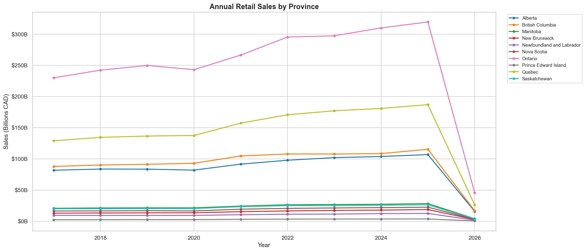

**Insight:** Ontario and Quebec exhibit diverging post-COVID trajectories — Ontario recovered faster and maintained a steeper growth slope. British Columbia accelerated significantly post-2021. Alberta's trend is flatter, suggesting structural headwinds in its local economy affecting consumer spending.

---

### 10 · E-Commerce Sales Share

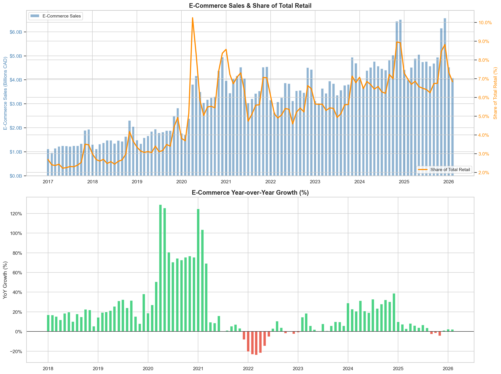

**Insight:** E-Commerce's share of retail grew from **2.68% (2017)** to **6.83% (latest)** — a **+4.15 percentage point** increase. More tellingly, e-commerce YoY growth averaged **20.9%**, compared to just **4.4%** for total retail. Despite the rising share, digital retail remains a minority channel, suggesting substantial future growth headroom.

---

### 11 · Seasonally Adjusted vs. Unadjusted

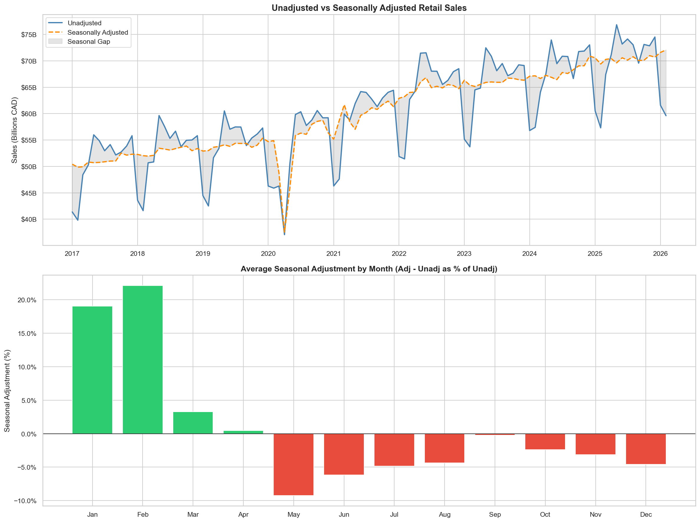

**Insight:** On average, the seasonal adjustment smooths out a **7.0% variance** relative to unadjusted figures. Unadjusted sales spike sharply in Q4 (November/December) and dip in Q1 — patterns that would distort trend analysis if not controlled for. The adjusted series reveals the true underlying demand trajectory.

---

### 12 · Monthly Sales Heatmap (Year × Month)

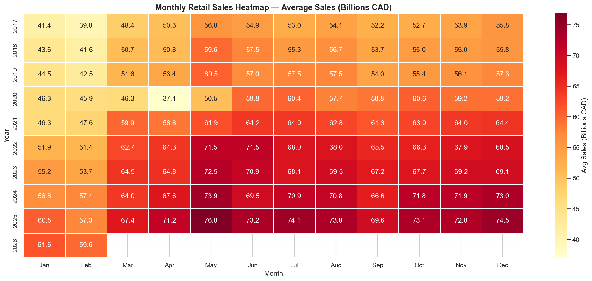

**Insight:** The heatmap confirms that **May, June, and December** are consistently the three strongest retail months annually. **January and February** are the weakest across every year in the dataset. The COVID crash of April 2020 appears as a visually distinct cold spot — one of the most statistically anomalous months in the entire 9-year period.

---

### 13 · Holiday Sales Spike

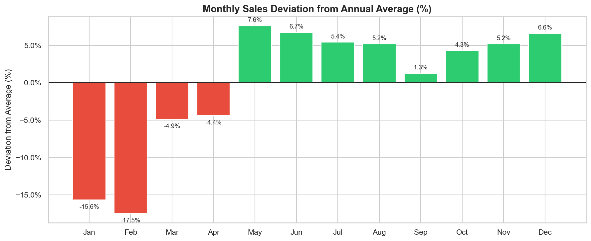

**Insight:** November registers **+5.2%** above the annual average and December reaches **+6.6%** — confirming the holiday season as the single most critical retail period. Industries like General Merchandise and Electronics show spikes of 15–25% in these months, making inventory and staffing planning in Q4 essential for profitability.

---

### 14 · Seasonal Stability Score

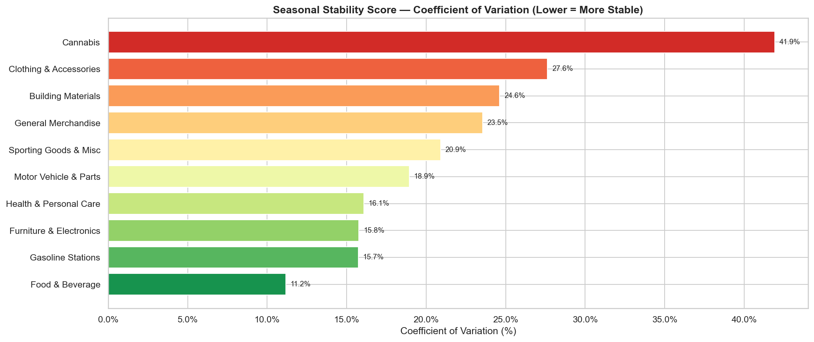

**Insight:** **Food & Beverage** is the most seasonally stable industry (CV: 11.2%), making it the safest bet for consistent revenue. **Cannabis** is the most volatile (CV: 41.9%), reflecting its immaturity as a sector and rapidly changing consumer adoption. Retailers in volatile sectors should build larger working capital buffers.

---

### 15 · Forecast Visualization

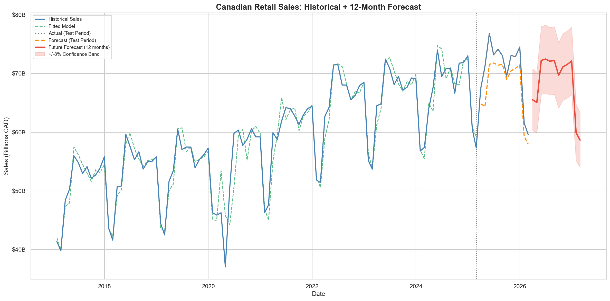

**Insight:** The Holt-Winters model achieves a **MAPE of 3.79%** and MAE of $2.70B/month — strong accuracy for monthly retail forecasting. The 12-month forward forecast projects a **−10.5% trend direction**, primarily reflecting seasonal normalization after the 2025 summer peak. Sales are expected to return to the $58–73B monthly range through early 2027.

---

## 📈 Power BI Dashboards

The Power BI report consists of **4 interactive pages** built on a star-schema data model with slicers for Province, Year, Month, and Adjustment Type.

---

### Dashboard 1 — Executive Overview

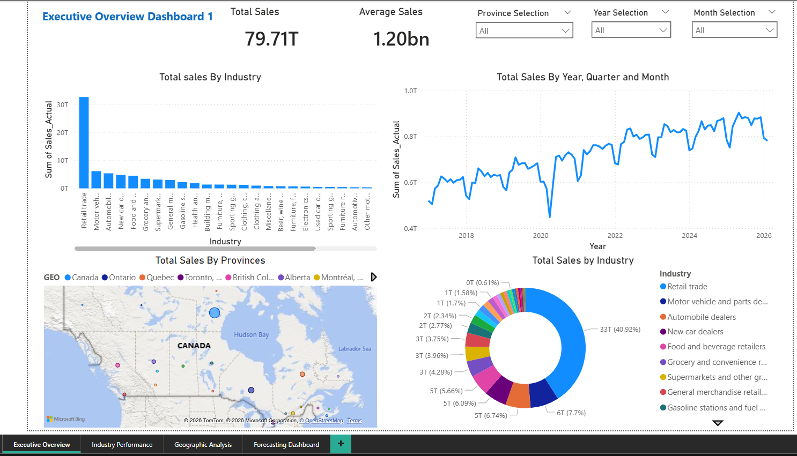

**Audience:** C-suite executives, board members, senior leadership

**Key Visuals:**
- KPI cards: Total Sales ($79.71T cumulative), Average Monthly Sales ($1.20B displayed)
- Bar chart: Total Sales by Industry (all sectors ranked)
- Line chart: Total Sales by Year, Quarter & Month (2017–2026 trend)
- Map of Canada: Total Sales by Province (geographic distribution)
- Donut chart: Industry share breakdown

**Slicers:** Province Selection · Year Selection · Month Selection

---

### Dashboard 2 — Industry Performance

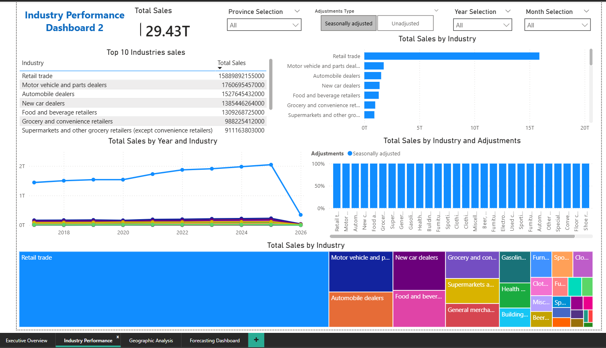

**Audience:** Category managers, merchandising teams, strategy analysts

**Key Visuals:**
- Ranked table: Top 10 industries by total sales with exact figures
- Horizontal bar chart: Industry-wise total sales comparison
- Multi-line chart: Total Sales by Year and Industry (trend lines per sector)
- Stacked bar: Sales by Industry and Adjustment Type (100% view)
- Treemap: Market share by industry (visual proportional representation)

**Toggle:** Seasonally Adjusted ↔ Unadjusted switch

---

### Dashboard 3 — Geographic Analysis

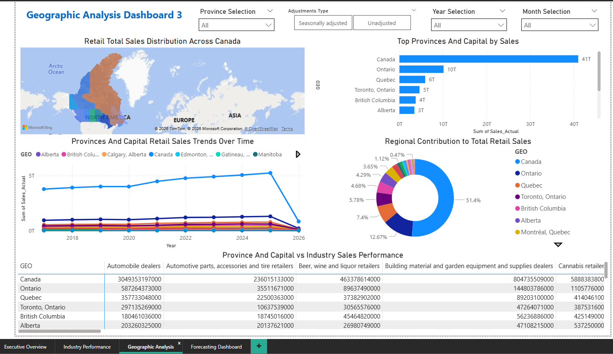

**Audience:** Regional sales managers, government policy teams, real estate planners

**Key Visuals:**
- Filled map: Retail total sales distribution across Canada
- Bar chart: Top provinces and capital cities by total sales
- Multi-line trend chart: Provincial sales trends over time
- Donut chart: Regional contribution to total retail sales (%)
- Cross-tab matrix: Province × Industry sales performance table

---

### Dashboard 4 — Forecasting

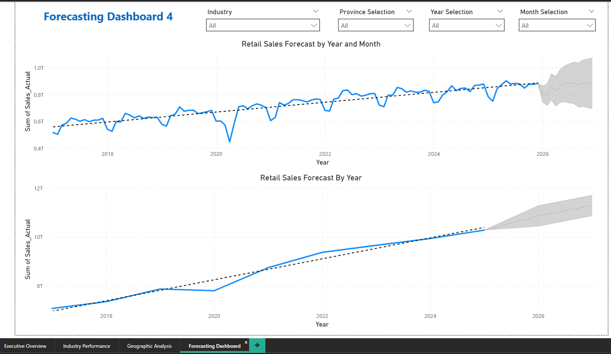

**Audience:** Supply chain planners, finance teams, demand analysts

**Key Visuals:**
- Forecast line chart with confidence interval band (±8%)
- Historical vs. predicted overlay for model validation
- 12-month forward projection table (March 2026 – February 2027)
- Model performance card (MAPE: 3.79%)

### Power BI Data Model

The report uses a **star schema** architecture:

```
         ┌─────────────┐
         │  Date Table  │
         │ Year/Month/Q │
         └──────┬──────┘
                │
┌────────┐  ┌───┴──────────┐  ┌───────────┐
│ Geo    ├──┤ Retail Sales  ├──┤ Industry  │
│ Table  │  │ Fact Table    │  │ Table     │
└────────┘  └───────┬──────┘  └───────────┘
                    │
             ┌──────┴──────┐
             │ Adjustment   │
             │ Type Table   │
             └─────────────┘
```

---

## 📌 Key KPI Results

### Sales KPIs

| KPI | Value |
|-----|-------|
| Total Retail Sales (All-Time) | **$6.60 Trillion CAD** |
| Average Monthly Sales | **$60.04 Billion** |
| Average MoM Growth | **+0.82%** |
| Average YoY Growth | **+4.39%** |
| Peak Sales Month | **May 2025 — $76.83B** |
| Lowest Sales Month | **April 2020 — $37.07B** (COVID) |

### Industry KPIs

| KPI | Value |
|-----|-------|
| Top Industry by Sales | **Motor Vehicle & Parts Dealers** |
| Top Market Share (2025) | **27.0%** |
| Fastest Growing Industry | **General Merchandise (+74.6%)** |
| Most Stable Industry | **Food & Beverage (CV: 11.2%)** |
| Most Volatile Industry | **Cannabis (CV: 41.9%)** |

### Geographic KPIs

| KPI | Value |
|-----|-------|
| Top Province by Sales | **Ontario** |
| Ontario's Contribution | **38.0% of national retail** |
| Fastest Growing Province | **Prince Edward Island (+50.3%)** |
| Slowest Growing Province | **Alberta (+30.8%)** |

### E-Commerce KPIs

| KPI | Value |
|-----|-------|
| Initial E-Commerce Share (2017) | **2.68%** |
| Latest E-Commerce Share | **6.83%** |
| Digital Adoption Rate Increase | **+4.15 percentage points** |
| E-Commerce vs Total Retail YoY | **20.9% vs 4.4%** |

### Seasonal KPIs

| KPI | Value |
|-----|-------|
| November Holiday Spike | **+5.2% above annual average** |
| December Holiday Spike | **+6.6% above annual average** |
| Avg Seasonal Adjustment Gap | **7.0% of unadjusted sales** |

### Forecasting KPIs

| KPI | Value |
|-----|-------|
| Model Used | **Holt-Winters Triple Exponential Smoothing** |
| Forecast Accuracy (MAPE) | **3.79%** |
| Mean Absolute Error | **$2.70B/month** |
| 12-Month Trend Direction | **DECREASING (−10.5%)** — seasonal normalization |

---

## 🔮 Forecasting

**Model:** Holt-Winters Triple Exponential Smoothing (`statsmodels.tsa.holtwinters.ExponentialSmoothing`)

The model captures **level**, **trend**, and **seasonality** simultaneously — well-suited to retail data with strong monthly seasonal cycles.

### 12-Month Forward Sales Forecast

| Month | Forecast |
|-------|----------|
| March 2026 | $65.53B |
| April 2026 | $65.06B |
| May 2026 | $72.23B |
| June 2026 | $72.46B |
| July 2026 | $72.10B |
| August 2026 | $72.20B |
| September 2026 | $69.70B |
| October 2026 | $71.14B |
| November 2026 | $71.54B |
| December 2026 | $72.14B |
| January 2027 | $59.95B |
| February 2027 | $58.66B |

> All forecasts carry a ±8% confidence band. The MAPE of 3.79% means the model's predictions are within ~$2.7B of actual monthly sales on average.

---

## 💡 Recommendations & Suggestions

### For Retailers & Business Strategists

1. **Double down on General Merchandise.** With +74.6% growth over the study period, this is the highest-momentum sector. Retailers should evaluate if their product mix captures enough general merchandise SKUs.

2. **Prioritize Q4 inventory and staffing.** December's +6.6% holiday spike is consistent year over year. Supply chain planning should begin no later than August to ensure adequate stock and staffing for November–December demand.

3. **Invest aggressively in e-commerce.** At 20.9% YoY growth versus 4.4% for total retail, digital channels are growing ~5× faster. Retailers without a robust online presence risk structural market share erosion over the next decade.

4. **Hedge against volatility in Cannabis sector.** The Cannabis sector (CV: 41.9%) is unpredictable. Retailers or investors in this space should maintain larger liquidity reserves and avoid over-leveraging on inventory.

5. **Focus western expansion on British Columbia over Alberta.** BC shows stronger post-2021 retail growth and population-driven demand trends. Alberta's flatter trajectory warrants a more cautious investment posture.

### For Policymakers & Government Analysts

6. **Monitor PEI's retail growth trajectory.** Prince Edward Island's +50.3% growth rate is exceptional for a small province. Policy support for small business infrastructure and e-commerce logistics here could sustain and amplify this trend.

7. **Re-examine regional retail equity.** Ontario and Quebec capturing ~60% of national retail activity creates systemic vulnerability. Policies encouraging retail development in Atlantic and Prairie provinces could improve national economic resilience.

8. **Track e-commerce's fiscal impact.** As digital retail grows, provincial sales tax collection mechanisms tied to physical point-of-sale may see erosion. Proactive regulatory frameworks for online transaction capture are advisable.

### For Data & Analytics Teams

9. **Integrate external signals into forecasting.** The current Holt-Winters model achieves 3.79% MAPE using only historical sales. Adding macroeconomic signals (CPI, unemployment, fuel prices, consumer confidence) could push accuracy below 2.5%.

10. **Build anomaly detection into the pipeline.** The April 2020 outlier illustrates how external shocks distort time-series models. An automated anomaly flagging layer (e.g., isolation forest or STL decomposition residuals) should be added before any model retraining cycle.

11. **Expand e-commerce analysis at the provincial level.** Currently e-commerce data is only available nationally. Advocating for Statistics Canada to disaggregate digital sales by province would unlock significant analytical value.

---

## ▶ How to Run

### Prerequisites

```bash
pip install pandas numpy matplotlib seaborn statsmodels jupyter
```

### Steps

```bash
# 1. Clone the repository
git clone https://github.com/your-username/canadian-retail-sales-analysis.git
cd canadian-retail-sales-analysis

# 2. Download the dataset from Statistics Canada
# https://www150.statcan.gc.ca/n1/tbl/csv/20100056-eng.zip
# Extract 20100056.csv into ./Dataset/

# 3. Run the data cleaning notebook
jupyter notebook Data_cleaning.ipynb

# 4. Run the analysis and forecasting notebook
jupyter notebook Data_Analysis.ipynb

# 5. Open PowerBI_Dashboard.pbix in Power BI Desktop
#    (requires Microsoft Power BI Desktop — free download)
```

### Output

- 15 visualization PNG files saved to `visualizations_images/`
- Cleaned dataset available as a DataFrame throughout analysis
- 12-month retail sales forecast with confidence bands
- Interactive Power BI `.pbix` dashboard file

---

## 👤 Author

**Your Name**
Data Analyst | Python · Power BI · Statistics Canada Data

- 📧 mhamzas250@email.com
- 💼 [LinkedIn](https://www.linkedin.com/in/muhammad-hamza-khattak/)
- 🐙 [GitHub](https://github.com/mrhamxo)

---

## 📜 Data License & Citation

Data sourced from:

> Statistics Canada. Table 20-10-0056-01 — Retail trade sales by province and territory (x 1,000).
> https://www150.statcan.gc.ca/t1/tbl1/en/tv.action?pid=2010005601
> Reproduced and distributed on an "as is" basis with the permission of Statistics Canada.

Statistics Canada open data is made available under the [Statistics Canada Open Licence](https://www.statcan.gc.ca/en/reference/licence).
